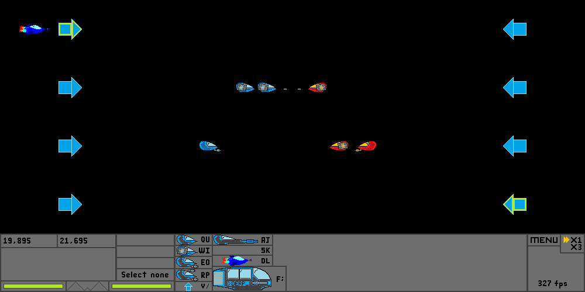
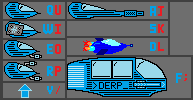

# Introduction
This is a high school project I last worked on in 2015. It is a local multiplayer game featuring 2 opposing sides sending units down 4 separate lanes to fight.

# How to play
This game is played by 2 players, the left (blue) and right (red). For a player to win, he/she must reduce the opposing player's HP to 0. Each player starts with 100HP and loses 1HP for every enemy ship that passes into your base.

There are 4 lanes in the game to send ships through for the left player to select a lane, the buttons (1, 2, 3 and 4) are used while for the right player it is (7, 8, 9, 0). Once the preferred lane is selected, a player can press the buttons indicated by the menu to send ships.

In this picture, the letters highlighted in blue are the controls for the left player and the ones in red are for the right player. By pressing the indicated key, the corresponding ship will be "bought" and sent in the lane selected by the player. Each ship is special in its own way and the main stats of each ship can be seen by clicking on the button of the ship. Ships will travel down the lane towards the enemy's base and when another ship is in range, stop moving and fire at them.

Each player starts with 10,000 "dollars" and starts by gaining 1 "dollar" per cycle. Side note: fps denotes the number of cycles per second. Each cycle does processing (giving a person his money, ships shooting, etc) and drawing of the game. The only thing you cannot get stats for is the weird up-pointing arrow. This is the upgrade button. By pressing the respective key on the keyboard, if possible, a player will lose 50,000 "dollars" and gain one more "dollar" per cycle.

Enjoy the game with a friend!
